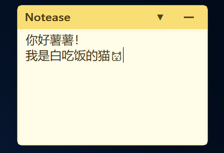

# Notease

Notease 是一个原生 C++ / Win32 桌面悬浮便签，提供简洁的多行文字编辑功能。



## 功能

- 顶部标题栏提供图钉置顶和最小化按钮，最小化后点击托盘图标可重新显示便签。
- 图钉左侧的加号可以创建独立的空白便签实例；子实例仅显示垃圾桶按钮，可单独删除。
- 点击 `Notease` 标题可清空当前文本。
- 托盘菜单支持切换 Windows 用户自启动。
- 母实例和子实例的文本、位置及大小统一保存到 exe 所在目录的 `notease.json`。

## 配置

配置文件名称为 `notease.json`。从托盘图标右键菜单切换自启动后，配置文件和以下注册表位置会同步更新：

示例配置：

```json
{
  "note": "便签内容",
  "autostart": true,
  "alwaysOnTop": false,
  "windowPositionValid": true,
  "windowLeft": 500,
  "windowTop": 300,
  "windowSizeValid": true,
  "windowWidth": 380,
  "windowHeight": 280,
  "instances": [
    {
      "id": 1,
      "note": "子实例内容",
      "alwaysOnTop": false,
      "windowPositionValid": true,
      "windowLeft": 540,
      "windowTop": 340,
      "windowSizeValid": true,
      "windowWidth": 380,
      "windowHeight": 280
    }
  ]
}
```

旧版没有 `instances` 字段的配置会继续按母实例格式读取。

```text
HKEY_CURRENT_USER\\Software\\Microsoft\\Windows\\CurrentVersion\\Run
```

注册表值名称为 `Notease`，不需要管理员权限。

## 编译

在安装了 Visual Studio C++ 工具链的 PowerShell 中运行：

```powershell
.\build.ps1
```

生成文件：

```text
build\\Notease.exe
```

也可以使用 CMake 配置 `CMakeLists.txt`。
